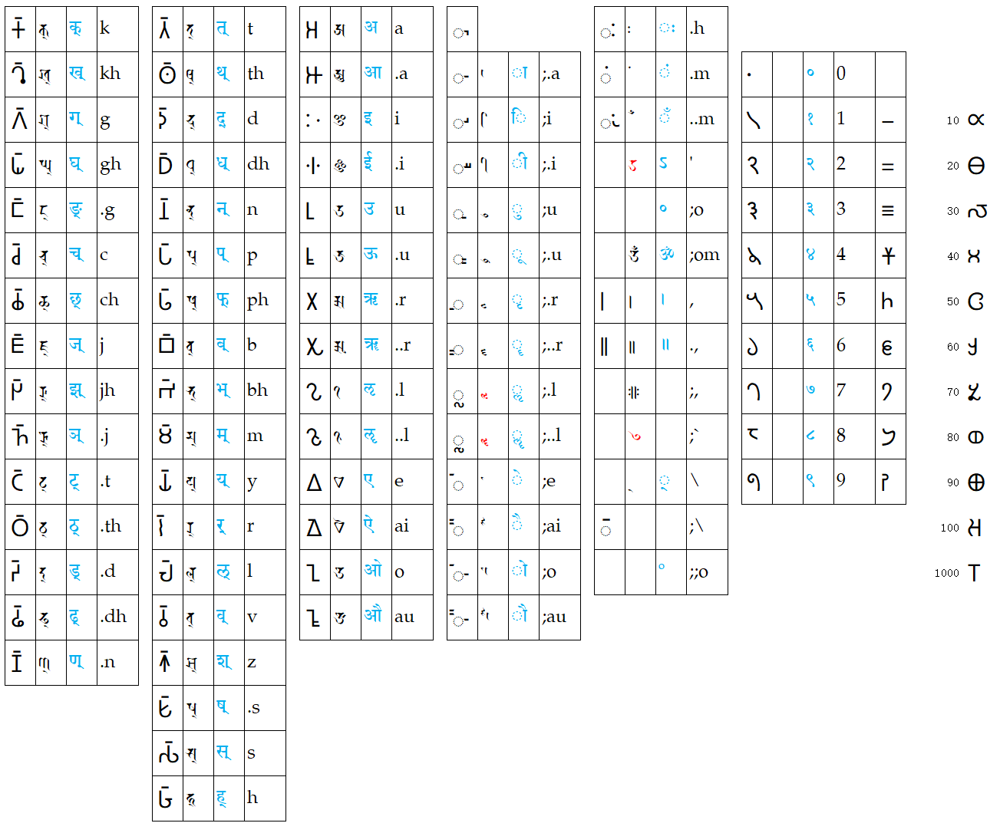

# **Rime小狼毫輸入法安裝與使用**

https://docs.qq.com/doc/DQW1nbmZZTEFNQVNx

# **rime梵藏輸入方案**

- **天城體** devanagari

https://github.com/arpcn/rime-devanagari/

- **IAST**

https://github.com/arpcn/rime-iast

- **悉曇體**及**婆羅米** Siddham & Brahmi

https://github.com/arpcn/rime-siddham

- **藏文**

https://github.com/arpcn/rime-tibetan

# **鍵盤分布**

這一套輸入方案中，IAST、天城、悉曇、婆羅米、藏文，都是[**一樣的編碼方式**](#)。

查看 ☞ <b><i>表格文本</i></b> ☜ 點擊 ◂ 

|𑀓𑁆|𑖎𑖿|क्|k||𑀢𑁆|𑖝𑖿|त्|t||𑀅|𑖀|अ|a||𑀹|||||𑀂|𑖾|ः|.h||||||||||
|-|-|-|-|-|-|-|-|-|-|-|-|-|-|-|-|-|-|-|-|-|-|-|-|-|-|-|-|-|-|-|-|-|
|𑀔𑁆|𑖏𑖿|ख्|kh||𑀣𑁆|𑖞𑖿|थ्|th||𑀆|𑖁|आ|.a||𑀸|𑖯|ा|;.a||𑀁|𑖽|ं|.m||𑁦||०|0|||||
|𑀕𑁆|𑖐𑖿|ग्|g||𑀤𑁆|𑖟𑖿|द्|d||𑀇|𑖂|इ|i||𑀺|𑖰|ि|;i||𑀀|𑖼|ँ|..m||𑁧||१|1|𑁒||10|𑁛|
|𑀖𑁆|𑖑𑖿|घ्|gh||𑀥𑁆|𑖠𑖿|ध्|dh||𑀈|𑖃|ई|.i||𑀻|𑖱|ी|;.i|||𑗈|ऽ|'||𑁨||२|2|𑁓||20|𑁜|
|𑀗𑁆|𑖒𑖿|ङ्|.g||𑀦𑁆|𑖡𑖿|न्|n||𑀉|𑖄|उ|u||𑀼|𑖲|ु|;u||||॰|;o||𑁩||३|3|𑁔||30|𑁝|
|𑀘𑁆|𑖓𑖿|च्|c||𑀧𑁆|𑖢𑖿|प्|p||𑀊|𑖅|ऊ|.u||𑀽|𑖳|ू|;.u|||𑖌𑖼|ॐ|;om||𑁪||४|4|𑁕||40|𑁞|
|𑀙𑁆|𑖔𑖿|छ्|ch||𑀨𑁆|𑖣𑖿|फ्|ph||𑀋|𑖆|ऋ|.r||𑀾|𑖴|ृ|;.r||𑁇|𑗂|।|,||𑁫||५|5|𑁖||50|𑁟|
|𑀚𑁆|𑖕𑖿|ज्|j||𑀩𑁆|𑖤𑖿|ब्|b||𑀌|𑖇|ॠ|..r||𑀿|𑖵|ॄ|;..r||𑁈|𑗃|॥|.,||𑁬||६|6|𑁗||60|𑁠|
|𑀛𑁆|𑖖𑖿|झ्|jh||𑀪𑁆|𑖥𑖿|भ्|bh||𑀍|𑖈|ऌ|.l||𑁀|𑗆|ॢ|;.l|||𑗉||;,||𑁭||७|7|𑁘||70|𑁡|
|𑀜𑁆|𑖗𑖿|ञ्|.j||𑀫𑁆|𑖦𑖿|म्|m||𑀎|𑖉|ॡ|..l||𑁁|𑗇|ॣ|;..l|||𑗁||;`||𑁮||८|8|𑁙||80|𑁢|
|𑀝𑁆|𑖘𑖿|ट्|.t||𑀬𑁆|𑖧𑖿|य्|y||𑀏|𑖊|ए|e||𑁂|𑖸|े|;e|||𑖿|्|\ ||𑁯||९|9|𑁚||90|𑁣|
|𑀞𑁆|𑖙𑖿|ठ्|.th||𑀭𑁆|𑖨𑖿|र्|r||𑀐|𑖋|ऐ|ai||𑁃|𑖹|ै|;ai||𑁆|||;\ ||||||||100|𑁤|
|𑀟𑁆|𑖚𑖿|ड्|.d||𑀮𑁆|𑖩𑖿|ल्|l||𑀑|𑖌|ओ|o||𑁄|𑖺|ो|;o||||º|;;o||||||||1000|𑁥|
|𑀠𑁆|𑖛𑖿|ढ्|.dh||𑀯𑁆|𑖪𑖿|व्|v||𑀒|𑖍|औ|au||𑁅|𑖻|ौ|;au|||||||||||||||
|𑀡𑁆|𑖜𑖿|ण्|.n||𑀰𑁆|𑖫𑖿|श्|z|||||||||||||||||||||||||
||||||𑀱𑁆|𑖬𑖿|ष्|.s|||||||||||||||||||||||||
||||||𑀲𑁆|𑖭𑖿|स्|s|||||||||||||||||||||||||
||||||𑀳𑁆|𑖮𑖿|ह्|h|||||||||||||||||||||||||

